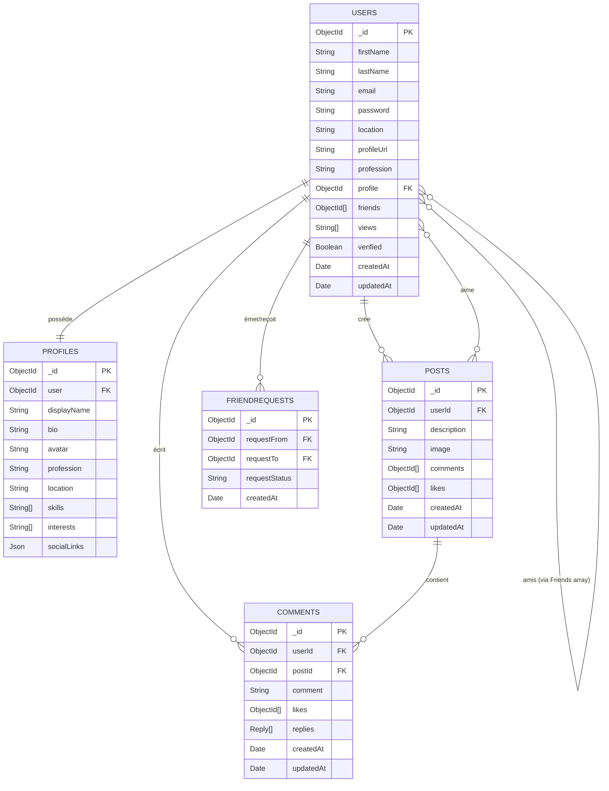

# Rapport Technique – Projet MERN “Connecty”

## 1. Objectif du projet
Connecty est un mini réseau social professionnel construit sur la stack MERN (MongoDB, Express.js, React, Node.js).  
Les principaux objectifs pédagogiques et techniques sont :
- Démontrer la maîtrise d’un REST API sécurisé et d’une SPA moderne.
- Mettre en œuvre l’authentification JWT, la gestion des profils, publications, commentaires et interactions (likes, demandes d’amis).
- Intégrer des fonctionnalités IA basées sur Gemini : génération d’idées de posts, analyse de sentiments et chatbot conversationnel.
- Appliquer les bonnes pratiques (architecture claire, validations, middleware, CI possible) pour faciliter la soutenance et la maintenance.
- Produire un code documenté accompagné d’un rapport et d’un schéma ER.

## 2. Architecture générale
### 2.1 Backend (Node.js + Express + MongoDB)
- **Structure** : `controllers/`, `routes/`, `services/`, `models/`, `middleware/`, `utils/`, `config/`.
- **Base de données** : MongoDB Atlas, ORM Mongoose, schéma respectant min 5 entités.
- **Sécurité** :
  - Hashage via `bcrypt`.
  - Authentification JWT (création, vérification dans `authMiddleware` + rafraîchissement côté client).
  - Variables sensibles dans `.env` (`MONGODB_URL`, `JWT_SECRET`, `GEMINI_API_KEY`, SMTP, FRONT_URL).
  - Validation des entrées via `express-validator` (auth, posts, AI, etc.).
  - Middleware personnalisés : `userAuth`, `validationMiddleware`, gestion centralisée des erreurs, CORS configuré.
- **Services métier** :
  - `aiService.js` (Gemini).
  - `sendEmail.js` (vérification compte, reset password).
  - `utils/index.js` (hash, compare, création de JWT).
- **Notifications email** : Nodemailer + templates HTML.
- **Journalisation** : console + messages d’erreur uniformisés envoyés au middleware Express.

### 2.2 Frontend (React + Vite + Redux Toolkit)
- **Structure** : `components/`, `pages/`, `redux/`, `assets/`, `utils/`.
- SPA avec React Router v6 : `Layout` protège les routes privées et redirige vers `/login`.
- Redux Toolkit : slices `user`, `theme`, `posts`, `chat`.  
  - `chatSlice` gère l’état du chatbot (messages, loading, erreurs, chatId persisté).
- UI TailwindCSS + Heroicons/React-Icons : composants réutilisables (`InputText`, `CustomButton`, `Chatbot`, `FloatingChatbot`, `Navbar`).
- Intégration API via `apiRequest` (Axios) avec gestion des tokens.
- Formulaires gérés par `react-hook-form` (validation côté client).
- Accessibilité : boutons avec labels, focus visibles, feedback visuel (spinners, toasts).

### 2.3 Flux utilisateur type (register → feed → IA)
1. L’utilisateur remplit le formulaire Register (validations client + serveur).  
   - Backend crée User + Profile, envoie email de vérification via `sendVerificationEmail`.  
2. Après vérification, l’utilisateur se connecte (`/auth/login`) → JWT stocké côté front, Redux hydrate l’état `user`.  
3. L’accès au feed (`/`) déclenche `fetchPosts`. L’utilisateur peut créer/liker/commenter.  
4. Pour l’IA :  
   - Idées de posts : formulaire dédié appelle `POST /ai/post-ideas`.  
   - Analyse de sentiments : textarea + requête `POST /ai/sentiment`.  
   - Chatbot : bouton navbar ouvre le widget flottant (Redux) ou page `/chatbot`.  
5. Les réponses IA sont affichées en direct avec états de chargement/erreur.

### 2.4 Tests & validations
- Tests manuels :  
  - Auth (register/login, erreur validation, email déjà pris).  
  - Posts (CRUD, likes, commentaires).  
  - IA (3 endpoints).  
- Vérifications techniques :  
  - `npm run dev` backend + MongoDB connecté.  
  - `npm run dev` frontend (Vite).  
  - Postman collections pour routes auth/posts/ai.  
- Possibilité d’ajouter des tests automatisés (Jest/Supertest) – mentionné comme piste d’amélioration.

## 3. Modèle de données & relations (Extrait)



### Diagramme de workflow (expérience utilisateur)

```mermaid
flowchart TD
    A[Visiteur] -->|Accès /register ou /login| B{Formulaire valide ?}
    B -- Non --> B1[Messages d'erreur côté client]
    B -- Oui --> C[API /auth/register ou /auth/login]
    C -->|Succès + JWT| D[Redux.user mis à jour]
    C -->|Échec| C1[Toast erreur + logs backend]
    D --> E[Layout protégé charge le feed]
    E --> F[Utilisation API /posts (CRUD, likes, comments)]
    F --> G{Fonctionnalité IA ?}
    G -- Idées --> H[/ai/post-ideas → affichage suggestions/]
    G -- Sentiment --> I[/ai/sentiment → score + recommandations/]
    G -- Chatbot --> J[Widget flottant / page Chatbot]
    J -->|Messages| K[/ai/chat → réponses Gemini/]
    K --> L[Stockage dans chatSlice + affichage temps réel]
```

### Diagramme d’architecture globale

```mermaid
graph LR
    subgraph Frontend (React/Vite)
        UI[Pages & Composants] --> RTK[Redux Toolkit]
        RTK --> API[apiRequest (Axios)]
        UI --> Tailwind[Tailwind UI]
        UI --> RHF[react-hook-form]
    end

    subgraph Backend (Node/Express)
        Routes[Routes REST] --> Ctrls[Controllers]
        Ctrls --> Services[Services & Utils]
        Services --> DB[(MongoDB Atlas)]
        Services --> AI[Gemini API]
        Ctrls --> Middleware[Auth & Validation]
    end

    API -->|JWT + HTTPS| Routes
    Middleware --> Routes
    AI -.->|post-ideas / sentiment / chat| Routes

    subgraph Services externes
        SMTP[Nodemailer/SMTP]
    end

    Services --> SMTP
```

### Relations clés (et implémentation)
1. **User ↔ Profile (1‑1)** : contraintes `unique` sur `Profiles.user` et référence `Users.profile`. Méthode `pre('save')` assure la création du profil à l’inscription.  
2. **User ↔ Post (1‑N)** : `Posts.userId` pointe vers l’auteur. Les routes `/posts` utilisent `userAuth` pour associer `req.user._id`.  
3. **Post ↔ Comment (1‑N)** : `Comments.postId`. Les contrôleurs commentaires vérifient que le post existe avant insertion.  
4. **User ↔ User (N‑N)** : `FriendRequest` stocke les demandes (pending/accepted). Lorsque `requestStatus` passe à `accepted`, les deux utilisateurs sont ajoutés à `Users.friends`.  
5. **User ↔ Post (N‑N)** : likes via tableaux d’ObjectId des utilisateurs (`Posts.likes`). Les contrôleurs empêchent les doublons via `includes`.  
6. **User ↔ Comment (1‑N)** : `Comments.userId` pour vérifier l’auteur avant update/delete.  
7. **Post ↔ IA Insights** : non stocké en base mais la réponse IA peut être associée à un post côté front (future amélioration mentionnée).

## 4. API REST & routes principales
| Domaine | Routes principales | Notes |
|---------|--------------------|-------|
| Auth    | `POST /auth/register`, `POST /auth/login`, `POST /auth/logout`, `POST /auth/refresh` | Validation + envoi mail de vérification |
| Users   | `GET /users/me`, `PATCH /users/:id`, `POST /users/verify/:id/:token` | Routes protégées (JWT) |
| Posts   | CRUD complet (`/posts`) + like/unlike + commentaires imbriqués | Sécurisées |
| AI      | `POST /ai/post-ideas`, `POST /ai/sentiment`, `POST /ai/chat` | Appels Gemini |

## 5. Fonctionnalités IA (Gemini API)
1. **Génération d’idées** (`generatePostIdeas`) :  
   - Prompt contextualisé (sujet, ton, audience).  
   - Tentative de parsing strict JSON (`ideas[]`) sinon fallback texte.  
   - Utilisé côté front pour pré-remplir le formulaire de post.
2. **Analyse de sentiments** (`analyzeSentiment`) :  
   - Prompt qui impose un format JSON `{ sentiment, score, summary, recommendations[] }`.  
   - Utilisé pour évaluer les retours utilisateurs ou des posts existants.  
   - Frontend affiche score + recommandations.
3. **Chatbot** (`chatWithAI`) :  
   - Session gérée via `chatId` + historique des messages.  
   - `chatSlice` stocke les messages pour conserver le contexte même en navigation.  
   - Widget flottant + page dédiée offrent deux UX (accès instantané depuis la navbar ou expérience plein écran).  
   - Gestion des erreurs (ex : absence de token) avec message d’excuse.

## 6. Frontend – points clés
- Pages : Home (feed), Profile, Login, Register, ResetPassword, VerifyEmail, ChatbotPage.
- Composants : Navbar (thème + notifications + bouton chat), InputText, Chatbot, FloatingChatbot, etc.
- Gestion formulaire via `react-hook-form` + validations côté client.
- UX : feedback chargement (`Loading`), toasts d’erreurs, redirections.

## 7. Livrables & préparation soutenance
1. **Code source** : structure conforme (backend + frontend).
2. **README** : installation, scripts (`npm run dev` backend, `npm run dev` frontend).
3. **Mini rapport PDF** : exporter ce Markdown en PDF (Pandoc, Typst, “Export as PDF” VSCode).
4. **Soutenance** :
   - Démo live : auth, feed, création de post, IA (idées/sentiment/chatbot).
   - Questions techniques : JWT flow, schéma ER, middleware, prompts Gemini, choix Redux.
   - Compréhension architecture MERN exigée.

## 8. Modalités pratiques
- **Deadline** : veille de la soutenance à 23h59.
- **Livraison** :  
  - ZIP `NOM_Prenom_ProjetMERN.zip` ou repo GitHub privé partagé aux encadrants.  
  - Contient : backend/, frontend/, README.md, `.env.example`, `rapport.pdf`.  
- **Pénalité retard** : −2 pts/heure (max −10).
image login ïmage pag acceuill 
---
> Pense-bête : convertir ce fichier en PDF pour le mini-rapport officiel et joindre un schéma ER lisible (capture Mermaid ou rendu PNG/PDF).
