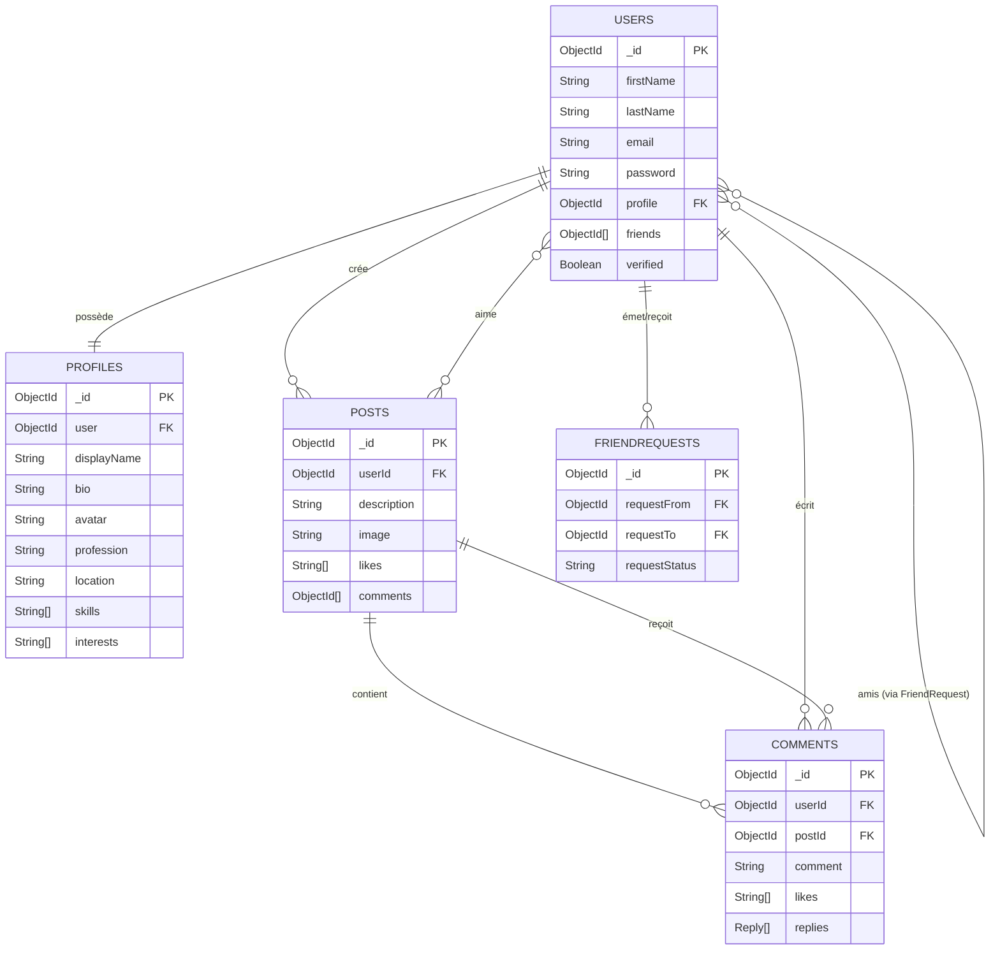

# Rapport Technique – Modélisation MERN

## Diagramme ER

### Relations clés
1. **User ↔ Profile (1‑1)** : garantit qu’un seul profil est associé à chaque utilisateur (contrainte `unique: true` dans `Users.profile` et `Profiles.user`).  
2. **User ↔ Posts (1‑N)** : un utilisateur peut créer plusieurs publications (`Posts.userId`).  
3. **Post ↔ Comments (1‑N)** : chaque post agrège plusieurs commentaires (`Comments.postId`).  
4. **User ↔ User (N‑N)** : les relations d’amitié sont matérialisées via `FriendRequest` puis stockées dans `Users.friends`.  
5. **User ↔ Post (N‑N)** : les likes utilisent un tableau d’identifiants utilisateurs pour chaque post (`Posts.likes`).  

> Export suggéré : convertir ce rapport Markdown en PDF (via pandoc, typst ou export VSCode) afin de respecter la consigne « mini rapport PDF ».
